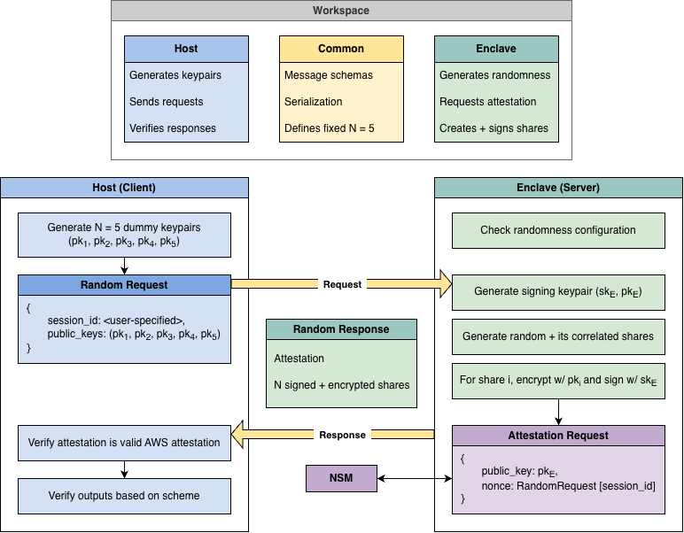

Correlated randomness is a building block that many multiparty computation protocols
assume they already have. This service generates it efficiently and securely inside an AWS Nitro Enclave, provided there is trust in AWS and AWS services.

This project contains a workspace (host, enclave, common) where the host AWS instance (or client) communicates with its enclave (or server) to request and receive random and correlated shares defined in common. To prove itself and the outputs, the enclave requests and provides an AWS attestation via NSM. The host then uses that attestation and the received shares and verifies everything locally.

Additional features include:

- Specify a session ID for a random request that the attestation should contain
- Save the attestation and outputs from a random request
- Verify an attestation is a valid AWS attestation
- Verify outputs based on an attestation and the enclave scheme
- Benchmark certain enclave and verification functions, and save benchmarks

Built as part of my work at Tools for Humanity.
