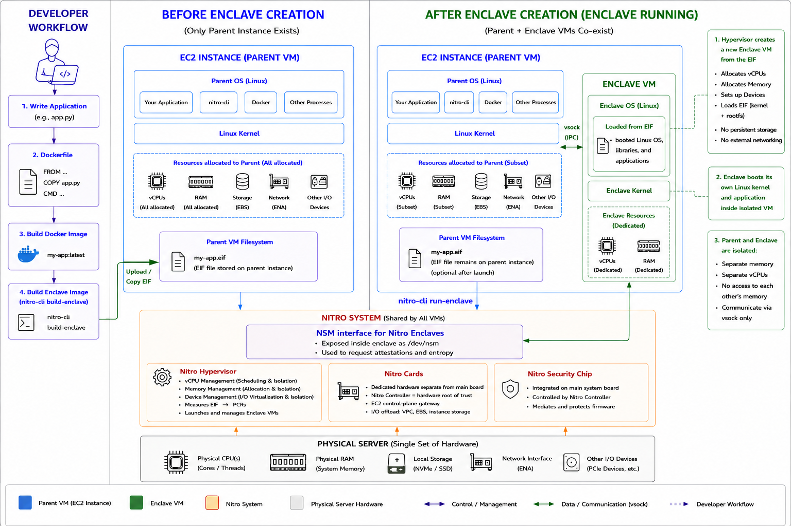
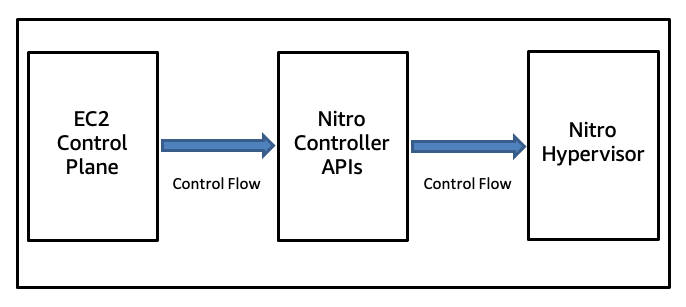
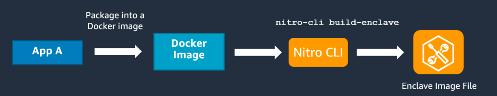

[Nitro Enclaves](https://docs.aws.amazon.com/enclaves/latest/user/nitro-enclave.html) is an enclave TEE, with its hardware root of trust being AWS. This enclave
is a microVM carved from a parent EC2 instance; it's only active while its parent is
active, and can only communicate with its parent via vsock. With no external networking,
no users can SSH into the enclave, and the enclave's data and applications cannot be
accessed by the parent instance (including root/admin users). It has no persistent
storage.

Enclaves can request AWS to generate an attestation, an AWS-signed document of sorts
containing measurements specific to its identity, the code and environment it is running,
and other AWS considerations. This can then be used to prove the enclave's identity and
its results.

It is currently not post-quantum secure.

<toggle>
<title> Requirements & Considerations </title>

- Parent EC2 Instance
  - Range of allowed instances and Linux or Windows (2016+) OS
    - ⚠️ Only Linux instances can build an enclave image file (.eif)
  - Max 4 enclaves per parent instance
- Enclave
  - Linux OS
  - Can only communicate with its parent instance (through vsock)
  - Only active while parent instance is running
  - Supported in all AWS Regions (including AWS GovCloud), but not on Outposts, Local
    Zones, or Wavelength Zones
  - No external networking, no persistent storage

</toggle>

## Nitro Enclave and Nitro System

Before any theory, we first go over the AWS Nitro System and the Nitro Enclave's
architecture and security designs, as well as the Nitro Enclave's workflow.



_The above image is a TL;DR generated by ChatGPT_

<toggle>
<title>Relevant Nitro/AWS Services & Links</title>

- [Nitro Enclaves CLI](https://docs.aws.amazon.com/enclaves/latest/user/nitro-enclave-cli.html): command line tool used to create, manage, and terminate enclaves
  - Must be installed on the parent instance
- [Nitro Enclaves Developer AMI](https://aws.amazon.com/marketplace/pp/prodview-37z6ersmwouq2): contains the tools and components needed to develop
  enclave applications and to build enclave image files (EIF)
- [Nitro Enclaves SDK](https://github.com/aws/aws-nitro-enclaves-sdk-c): open-source library that can be used to develop enclave
  applications, or to update existing applications to run in an enclave
- [Nitro Security Module](https://github.com/aws/aws-nitro-enclaves-nsm-api) (NSM): custom Linux device within Nitro Enclaves, accessible via
  `/dev/nsm`. For requesting attestations, trusted entropy, and PCR manipulation
- [AWS Key Management Service](https://docs.aws.amazon.com/kms/latest/developerguide/overview.html) (KMS): service used to create and control keys, supports
  attestations for nitro enclaves
  - KMS key: root key protected by KMS that is used to encrypt a data key
  - Supports key rotations (manual, on-demand, automatic/periodic)
  - Mainly used if you want to use AWS-backed data keys, otherwise limited functionality
- [AWS Certificate Manager](https://docs.aws.amazon.com/enclaves/latest/user/nitro-enclave-refapp.html) (ACM): service that lets you easily provision, manage, and
  deploy public and private SSL/TLS certificates

</toggle>

### Nitro System Architecture



- **AWS Nitro System:** a virtualization infrastructure, combination of purpose-built
  system components and specialized firmware, and the underlying platform for all EC2
  instances
  - Made of [3 key components](https://docs.aws.amazon.com/whitepapers/latest/security-design-of-aws-nitro-system/the-components-of-the-nitro-system.html): Nitro Cards, Nitro Security Chip, and Nitro Hypervisor
- **Nitro Cards**: dedicated hardware components that implement EC2 instances'
  outward-facing control interfaces
  - EC2 Instance: made up of a "main system board" and one or more Nitro Cards
    - Main system board (or motherboard): contains host CPUs and memory, and runs all
      customer compute environments
    - Nitro Cards are logically and physically separate from system boards
  - **Nitro Controller:** primary Nitro Card, the hardware root of trust
    - Manages all other components of the server system
    - Gateway between physical server (Nitro Hypervisor) and EC2 control plane
    - System firmware as a whole is stored on an encrypted solid state drive (SSD)
      attached directly to the Nitro Controller. The encryption key for the SSD is
      designed to be protected by the combination of a [Trusted Platform Module](https://trustedcomputinggroup.org/resource/trusted-platform-module-tpm-summary/) (TPM) and
      the secure boot features of the SoC (system on a chip)
    - TPM: A dedicated chip that has a key embedded into it when it is built that cannot
      be changed (once again, must trust AWS)
    - Secure boot process: starts with boot ROM w/ extended chain of trust firmware
      measurements (recorded & compared by TPM)
  - Other Nitro Cards: same SoC and base firmware as Controller, just w/ additional
    hardware and specialized firmware applications for their specific functions
- **Nitro Security Chip:** extends Nitro Controller's trust and control to main system
  board
  - The Nitro Security Chip is controlled by the Nitro Controller, and is integrated into
    the server's main system board
  - During runtime, intercepts and moderates all operations to all firmware
  - Ensures that main system CPUs cannot update firmware in bare metal mode when Nitro
    Hypervisor is not active (but even if it is, still moderates)
  - Secure boot process: Works with Nitro Controller, controls the physical reset pins of
    the server system main board, including its CPUs
- **Nitro Hypervisor:** limited and minimally designed VM monitor
  - Hypervisor: a software layer over physical hardware components (usually CPUs, RAM,
    network, sometimes storage) that divides them and creates isolated virtual servers (no
    server can see other server's data). Allows for multi-tenancy
  - Receives VM management commands from Nitro Controller
  - Partitions memory and CPU resources
  - No networking stack, no general-purpose file system implementations, no peripheral
    device driver support, no interactive access mode (including shell)
  - Nitro Hypervisor code is a managed, cryptographically signed firmware-like component
    stored on the encrypted local storage attached to the Nitro Controller

### Nitro Enclave Architecture and Workflow



- A developer first [creates](https://docs.aws.amazon.com/enclaves/latest/user/building-eif.html) an application and packages it and its dependencies into a
  Docker image. They can then run `nitro-cli build-enclave` to obtain an Enclave Image
  File (EIF) and the enclave's measurements (PCRs 0-2):

  ```text
  Start building the Enclave Image...
  Enclave Image successfully created.
  {
  	"Measurements": {
  	    "HashAlgorithm": "Sha384 { ... }",
  	    "PCR0":"...",
  	    "PCR1":"...",
  	    "PCR2":"..."
  	}
  }
  ```

  - The EIF file contains the OS and applications that run inside the enclave
  - The developer should also [sign](https://docs.aws.amazon.com/enclaves/latest/user/cmd-nitro-sign-eif.html) the EIF by specifying `--private-key` and
    `--signing-certificate` with the build enclave command

- Launch the parent instance (and note its instance ID for PCR4). Install AWS Nitro
  Enclaves CLI and [other development tools](https://docs.aws.amazon.com/enclaves/latest/user/nitro-enclave-cli-install.html). Give signed EIF file to the parent instance.


- When `nitro-cli run-enclave` is called, the Nitro Hypervisor takes a fixed allocated
  number of vCPUs and memory pages, subtracted from the parent's resources, to create a
  fully protected independent VM in which to run the Nitro Enclave image
- Within the parent instance, create and [run](https://docs.aws.amazon.com/enclaves/latest/user/cmd-nitro-run-enclave.html) the enclave via `nitro-cli run-enclave`
  - The command errors if the certificate for the EIF file is no longer valid

  ```text
  nitro-cli run-enclave
      [--enclave-name enclave_name]
      [--cpu-count number_of_vcpus
      --cpu-ids list_of_vcpu_ids]
      --memory amount_of_memory_in_MiB
      --eif-path path_to_enclave_image_file
      [--enclave-cid cid_number]
      [--debug-mode]
      [--attach-console]
  ```

  - If the parent instance is enabled for multithreading, must specify an even number of
    vCPUs. Else, minimum number of vCPUs is 1.
    - The CPU #0 core (all its threads) is not assignable to enclaves
    - <highlight>[Worst case](https://blog.trailofbits.com/2024/09/24/notes-on-aws-nitro-enclaves-attack-surface/#randomness),
      enclave shares L3 cache with parent instance</highlight>
  - Minimum memory allocated is 64 MiB. Maximum must leave enough for the applications
    running on the parent instance
    - For data sealing, [AWS recommends](https://docs.aws.amazon.com/enclaves/latest/user/flow.html) using KMS w/ a cryptographic & attestation based
      process
    - To prevent DoS attacks, limit user memory usage

- Afterwards, the vCPUs and memory pages remain isolated by the Nitro Hypervisor. There is
  no external networking or persistent storage, and the enclave can only talk with its
  parent instance (through a vsock channel)

<toggle>
<title> If TEE needs external services </title>

- As Nitro Enclaves have no external networking, all communication with services must use
  the parent instance as proxy
- The enclave can authenticate itself to the service via its attestation
- The service must authenticate itself to the enclave via smth like a certificate chain.
  Thus, the enclave should contain all relevant CA bundles or keys prior to being built,
  and should have some TLS procedure implemented
- Can use [AWS ACM](#relevant-nitroaws-services--links) for more efficiency

</toggle>

### Enclave Randomness

- Nitro Enclaves are exposed to three possible sources of randomness: its initial
  randomness subsystem, NSM trusted entropy, and KMS random bytes
- On initial randomness:
  - The enclave boots its OS from the EIF and exposes standard OS randomness APIs
  - However, this source is not very strong and is not recommended
- NSM randomness:
  - **NSM hwrng driver:**
    - NSM offers a Linux hardware RNG driver, which an enclave can register to immediately
      and periodically add trusted entropy to the system
    - Configure `/sys/devices/virtual/misc/hw_random/rng_current` to `nsm-hwrng`
    - This affects the OS entropy pool, and thus all app-facing randomness interfaces
  - **NSM random bytes:**
    - Enclaves can request entropy (bytes) from NSM via a `GetRandom` Request
- **KMS random bytes:**
  - Enclaves can call KMS securely to obtain random bytes via a `GenerateRandom` call
- <highlight>The [recommendation](https://blog.trailofbits.com/2024/09/24/notes-on-aws-nitro-enclaves-attack-surface/#randomness) for maximum security for the enclave's randomness is immediately
  configuring the hwrng driver to NSM's, and periodically pull random bytes from NSM/KMS
  - The mixing of the OS RNG and bytes from NSM/KMS can be done in two ways, either mixing
    those bytes into `/dev/urandom`/ChaCha seed or app-level mixing
  - Opinion from some sources: Even the pulling of random bytes is optional
  </highlight>

### On Physical Possession Attacks

One main problem of TEEs is that if someone is in physical possession of the machine, they
can do all sorts of nasty and easy attacks on it. Fortunately for us, AWS only offers
virtual machines rather than the actual physical hardware, meaning evil physical
possession is less likely. AWS documents more about its infrastructure security [here](https://docs.aws.amazon.com/whitepapers/latest/security-design-of-aws-nitro-system/nitro-system-security-in-context.html).

A situation that is more capable of being compromised is if AWS native hardware is
installed at your site via AWS Outposts, but Nitro Enclaves is not supported on Outposts.

TL;DR Physical possession attacks on a Nitro Enclave is not a substantial concern.

## The Attestation

An enclave can request an "attestation", which is generated by the Nitro Hypervisor and
signed by the Nitro Attestation PKI, where measurements within can prove its identity.

- **Measurements**: Nitro Enclaves have six unique "[platform configuration registers](https://docs.aws.amazon.com/enclaves/latest/user/set-up-attestation.html)" (PCRs)

  | **PCR** | **Hash of…**                   | **Description**                                                                                           |
  | ------- | ------------------------------ | --------------------------------------------------------------------------------------------------------- |
  | PCR0    | EIF                            | Exposed when EIF is built                                                                                 |
  | PCR1    | Linux kernel & bootstrap       | Exposed when EIF is built                                                                                 |
  | PCR2    | Application                    | Exposed when EIF is built                                                                                 |
  | PCR3    | IAM role of parent instance    | Can self generate if you create & attach an instance profile w/ an associated IAM role to parent instance |
  | PCR4    | Instance ID of parent instance | Can self generate with the parent's instance ID                                                           |
  | PCR8    | EIF signing certificate        | Exposed when EIF is built, if given signing cert & private key                                            |
  - Note: Enclaves booted in debug mode have PCRs that are all zeroes
  - AWS recommends using PCR3 and PCR8 together for greatest flexibility

### The Attestation Document

- The attestation document is encoded in Concise Binary Object Representation (CBOR), and
  is signed with ECDSA 384 using [CBOR Object Signing and Encryption](https://github.com/awslabs/aws-nitro-enclaves-cose) (COSE)
- Enclaves can use NSM to [create a Request of type Attestation](https://github.com/aws/aws-nitro-enclaves-nsm-api/blob/8785071d7f9414d28b4b03d02b74ea470386c4ee/src/api/mod.rs#L118), only able to set the
  optional fields `public_key`, `user_data`, and `nonce`

```text
AttestationDocument = {
    module_id: text,               ; issuing Nitro hypervisor module ID
    timestamp: uint .size 8,       ; UTC time when document was created, in
                                   ; milliseconds since UNIX epoch
    digest: digest,                ; digest function used for calculating
                                   ; the register values
    pcrs: { + index => pcr },      ; map of all locked PCRs at the moment
                                   ; the attestation document was generated
    certificate: cert,             ; public key certificate for public key
                                   ; used to sign the attestation doc
    cabundle: [* cert],            ; issuing CA bundle for infra cert
    ? public_key: user_data,       ; DER-encoded key the attestation
                                   ; consumer can use to encrypt data with
    ? user_data: user_data,        ; signed user data, defined by protocol
    ? nonce: user_data,            ; cryptographic nonce provided by the
                                   ; consumer as proof of authenticity
}

cert = bytes .size (1..1024)       ; DER encoded certificate
user_data = bytes .size (0..1024)
pcr = bytes .size (32/48/64)       ; PCR content
index = 0..31
digest = "SHA384"
```

<toggle>
<title> More on the optional fields: </title>

- Note: Technically as long as the sizes are within the range, the enclave can put
  "anything" into these optional fields. The following are guidelines from AWS.
- **Nonce:** Service gives enclave a nonce, which the enclave puts in the attestation
  - Guarantees service is talking to a live enclave and not some adversary reusing an
    older attestation document
  - Services should treat this nonce as a one-time token
- **Public Key:** After generating a (public key, private key), enclave gives service
  public key
  - For sending secret data back to the enclave that only enclave can decrypt, or for
    the service to validate signatures made by the enclave
  - API calls that do not have mutating effects on the service side might consider not
    using a nonce and just encrypting responses to such a public key, since only the
    correct enclave could decrypt the responses. Note that this mechanism would not
    provide by itself protection against replay attacks.
- **User data:** Any data enclave can include in the attestation
  - Could carry API parameters, or signature of them, or could be used by enclave to
  sign off on an operation it completed (essentially used for additional trust)
  </toggle>

<highlight>

- Note that the `pcrs` map in the attestation are **locked PCRs** rather than all PCRs.
  Additionally, besides the six PCRs described earlier, there are 32 total indices.
  - PCRs can only be described (get lock status), locked, or extended. Thus, all locked
    PCRs stay locked and cannot be re-locked or changed during the enclave's lifetime
  - According to the [NSM Github repo](https://github.com/aws/aws-nitro-enclaves-nsm-api/blob/1993eeb0620d35f5cefc50b17638b432325328f9/nsm-test/src/bin/nsm-check.rs), PCRs 0-4 are "reserved PCRs", and PCRs 0-2 are
    populated at enclave creation (containing the built measurements)
    - The reason PCR8 is not a "reserved PCR" seems to be because it is conditional
  - PCRs 0-15 are always locked upon enclave creation anyways
  - All other PCRs are non-reserved and not initially locked. They can be extended with
    data (probably $h(\text{prev} \mathbin\| \text{data})$, though specific implementation is not
    revealed)
    - These can be used as additional measurements describing run-time states
  - Just because PCRs are locked and thus exposed in the attestation does not mean KMS or
    any other verifier must "use" them for validation
- For more information on how the PCRs are specifically calculated, and what exactly the
  EIF is, take a look at the [enclave image format crate](https://github.com/aws/aws-nitro-enclaves-image-format).

</highlight>

### Attestation Document Validation

- Here is the attestation document in representative text format (CBOR encoded irl)

  ```text
  18(/* COSE_Sign1 CBOR tag is 18 */
      {1: -35}, /* This is equivalent with {algorithm: ECDSA 384} */
      {}, /* We have nothing in unprotected */
      bstr .size (1..16384), /* Attestation Document */
      bstr .size (32/48/64) /* Signature */
  )
  ```

1. Decode the CBOR object and map it to a COSE_Sign1 structure
2. Extract the attestation document from the COSE_Sign1 structure
3. Verify the certificate's chain
4. Ensure that the attestation document is properly signed

- See more details [here](https://github.com/aws/aws-nitro-enclaves-nsm-api/blob/1993eeb0620d35f5cefc50b17638b432325328f9/docs/attestation_process.md).

### Post-Quantum Limitations

- In a post-quantum world, a sufficiently powerful quantum computer can use Shor's
  algorithm to break any cryptographic guarantees dependent on elliptic curve discrete log
  hardness
- The following are broken in a post-quantum world:
  - **Attestation document validity:** The document's signature is ECDSA
  - **PCR8 validity:** Only ECDSA keys are [allowed](https://docs.aws.amazon.com/enclaves/latest/user/cmd-nitro-sign-eif.html?utm_source=chatgpt.com) for signing
- Additionally, the optional fields are only 1024 bytes, which is less than both MLKEM768
  (PQ key encapsulation) and ML-DSA (PQ signature scheme)'s public key sizes
  - Though this can be "fixed" by hashing the public keys in the attestation, and including
    the full key in the enclave's output, it still depends on the attestation validity
